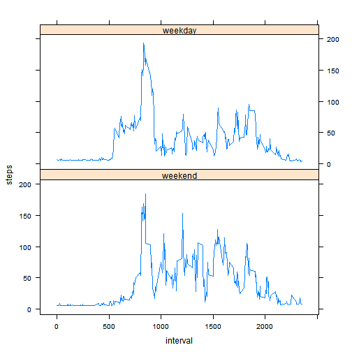

---
title: "Reproducible Research: Peer Assessment 1"
author: "Lizel Greyling"
date: "December 12, 2014"
output: 
  html_document:
    keep_md: true
---    

Movement Activity Monitoring
============================  

### 1. Loading and preprocessing data ##
The script will run correctly if the file "activity.csv" has been downloaded and unzipped to the working directory.

#### 1.1. Load the data ####
The script assumes that the data has been downloaded and unzipped to the working directory.

* Load required libraries:

```r
library(lubridate)
library(lattice)
```

* Read the data file:

```r
activity <- read.csv("activity.csv")
```
* Change the date field from factors to date values, using the libridate function ymd():

```r
activity$date <- ymd(activity$date)
```
#### 1.2. Process/transform the data into a format suitable for the analysis #### 

* Summarise the steps per day:

```r
daysteps <- aggregate(steps ~ date, data = activity, sum)
```

### 2. What is the mean total number of steps taken per day? ##  
  
For this part of the assignment, the missing values in the dataset are ignored.

#### 2.1. Histogram of the total number of steps taken each day ####

```r
hist(daysteps$steps, main = "Histogram of steps per day", xlab = "Steps per day")
```

 
  
#### 2.2. Calculate and report the mean and median total number of steps taken per day ####


```r
options(scipen=999)  #Used to remove scientific notation, makes output look nicer.
mean(daysteps$steps)
```

```
## [1] 10766.19
```

```r
median(daysteps$steps)
```

```
## [1] 10765
```
The mean number of steps per day is **10766** steps while the median is **10765** steps.   

### 3. Average daily activity pattern  
Create a dataset with the average number of steps per interval.  


```r
intervalsteps <- aggregate(steps ~ interval, data = activity, mean)
names(intervalsteps) <- c("interval","stepsmean")  
```
*The field names are changed to prepare for using a merge() function in step 4 (Replacing missing values).*
#### 3.1. Time series plot of the 5-minute interval (x-axis) and the average number of steps taken, averaged across all days 

```r
plot(stepsmean ~ interval, data = intervalsteps, type = "l",main = "Average steps per interval", xlab = "Interval", ylab="Average steps")
```

 

#### 3.2. Which 5-minute interval, on average across all the days in the dataset, contains the maximum number of steps?

```r
maxinterval <- intervalsteps[intervalsteps$steps==max(intervalsteps$steps),]
maxinterval
```

```
##     interval stepsmean
## 104      835  206.1698
```
The most steps are in interval **835**, which contains **206** steps.  

### 4. Replacing missing values

There are a number of days/intervals where there are missing values (coded as NA). The presence of missing days may introduce bias into some calculations or summaries of the data.

####4.1. Calculate and report the total number of missing values in the dataset.  


```r
missing <- sum(is.na(activity))
```

There are **2304** rows with missing values.  

####4.2. Devise a strategy for filling in all of the missing values in the dataset. 
Looking at the data, it seems that there is more variability between intervals than between days. Also, it is possible that there can be missing values for only some intervals in a day, but not for the whole day.

It therefore makes sense to replace any missing value on a interval-by-interval basis with the average for the interval, rather than replacing the missing values for a whole day with the average for the day.

####4.3. Create a new dataset that is equal to the original dataset but with the missing data filled in.

- Create a merged dataframe that is the same as *activity*, but with an additional column that contains the interval mean.

```r
activitymrgd <- merge(activity, intervalsteps)
```
- Create an index of rows with missing values:

```r
missingrows <- which(is.na(activity)) 
```
- Create a new dataset that is equal to the original dataset...

```r
activityclean <- activity
```
... and replace the missing values in the new dataset with the interval means:

```r
activityclean[missingrows,1] <- activitymrgd[missingrows,4]
```
- Check whether all missing values have been replaced:

```r
sum(is.na(activityclean))
```

```
## [1] 0
```
... and whether the new dataset has the same number of rows as the original:

```r
nrow(activityclean) - nrow(activity)
```

```
## [1] 0
```
  
####4.4. Histogram, mean and median total number of steps taken per day.  


```r
daystepsclean <- aggregate(steps ~ date, data = activityclean, sum)
hist(daystepsclean$steps, main = "Histogram of steps per day: NA's removed", xlab = "Steps per day")
```

 

```r
mean(daystepsclean$steps)
```

```
## [1] 10889.8
```

```r
median(daystepsclean$steps)
```

```
## [1] 11015
```
The mean is now 10890, compared to the original 10766; while the median is 11015 compared to the original 10765. There is quite a significant difference.

By estimating the missing values, both the mean and median have increased. The impact is that this might not actually reflect reality.

### 5. Are there differences in activity patterns between weekdays and weekends?

####5.1. Create a new factor variable in the dataset with two levels -- "weekday" and "weekend" indicating whether a given date is a weekday or weekend day.

- Add a column containing the weekday, using the lubridate package function wday():

```r
activityclean[,4] <- wday(activityclean$date)
names(activityclean)[4]<-"wday"
```
- Change the numeric value that represents the day of the week (Sunday = 1, etc.) to a character string, either "weekend" or "weekday". If the day is "1" (Sunday) or "6" (Saturday), the value will be "weekend", else it will be "weekday":

```r
activityclean$wday <- ifelse(activityclean$wday==1|activityclean$wday==6,"weekend","weekday")
```
- Change the character variable into a factor variable:

```r
activityclean$wday <- factor(activityclean$wday, levels = c("weekend","weekday"))
```
   
####5.2. Time series plot of the 5-minute interval and the average number of steps taken, averaged across all weekday days or weekend days. 


```r
cleanintervalsteps <- aggregate(steps ~ wday + interval, data = activityclean, mean)
xyplot(steps ~ interval|wday, type = "l", data = cleanintervalsteps,layout = c(1,2))
```

 
